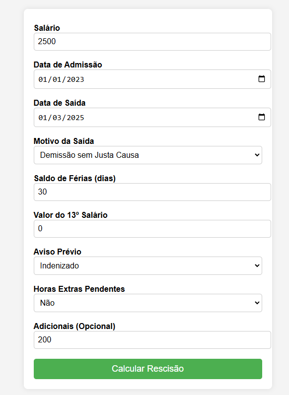
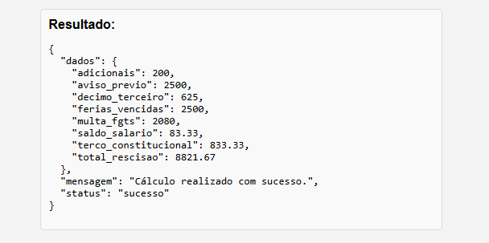

# Simulador de Rescisão em Python e Flask

## 📸 Capturas de Tela

    
    

## 📝  Descrição do Desafio

Crie um sistema que permita a um funcionário calcular sua rescisão ao sair da empresa. O sistema deve receber as informações necessárias e calcular corretamente os valores devidos conforme os direitos trabalhistas.

## 📌 Informações que o funcionário precisa fornecer

Para calcular corretamente a rescisão, precisamos coletar alguns dados do funcionário:

<b>Nome</b> (opcional, apenas para identificação)

<b>Data de admissão</b>

<b>Data de saída</b>

<b>Motivo da saída</b> ("pedido_demissao", "demissao_sem_justa_causa", "demissao_com_justa_causa")

<b>Salário atual</b>

<b>Saldo de férias</b> (quantidade de dias de férias vencidas e proporcionais)

<b>13º salário</b> (valor que o empregado ainda tem a receber)

<b>Aviso prévio</b> ("trabalhado" ou "indenizado")

<b>Horas extras pendentes</b> (Obrigatório: True ou False)

<b>Adicionais</b> (insalubridade, periculosidade, etc. - opcional)

## 💡 Lógica do Cálculo

A lógica do cálculo deve considerar:

<b>Saldo de salário:</b> calcular os dias trabalhados no mês da demissão.

<b>Aviso prévio:</b>

- Se foi trabalhado, incluir no saldo de salário.

- Se foi indenizado, incluir no cálculo como um salário cheio.

<b>Férias vencidas e proporcionais:</b>

- Férias vencidas = (Salário + 1/3 constitucional) se houver saldo.

- Férias proporcionais = (Salário / 12) * meses trabalhados desde o último período aquisitivo.

<b>13º salário proporcional:</b>

Se já recebeu alguma parcela, calcular apenas o valor restante.

Se não recebeu, considerar (Salário / 12) * meses trabalhados no ano.

<b>Multa de 40% sobre FGTS:</b> se for "demissao_sem_justa_causa".

<b>Descontos:</b>

- INSS e IRRF (imposto de renda retido na fonte).

- Adiantamentos salariais, se houver.

## 🚀 Implementação com Flask (Opcional)

Você também pode criar uma API Flask onde o funcionário possa enviar suas informações e receber o cálculo da rescisão. A API poderia ter:

- Uma rota POST para receber os dados do funcionário e processar os cálculos.

- Retornar um JSON com o detalhamento dos valores.

## 📌 Versionamento do Código

## 📌 Regras de Negócio e Estrutura dos Dados

Abaixo, organizamos as regras para garantir que o sistema processe a rescisão corretamente.

💡 Informações do Funcionário
| Campo              | Tipo                 | Obrigatório | Descrição |
|--------------------|---------------------|-------------|-------------|
| nome              | string               | ✅ Sim  | Nome do funcionário (opcional, apenas para identificação). |
| data_admissao     | string (YYYY-MM-DD)  | ✅ Sim   | Data de admissão do funcionário na empresa. |
| data_saida        | string (YYYY-MM-DD)  | ✅ Sim   | Data efetiva da saída do funcionário. |
| motivo_saida      | string               | ✅ Sim   | Motivo da saída: "pedido_demissao", "demissao_sem_justa_causa", "demissao_com_justa_causa". |
| salario          | float                | ✅ Sim   | Salário atual do funcionário. |
| saldo_ferias     | int (dias)           | ✅ Sim   | Quantidade de dias de férias vencidas e proporcionais. |
| decimo_terceiro  | float                | ✅ Sim   | Valor do 13º salário a receber (caso já tenha recebido alguma parcela, deve ser o valor restante). |
| aviso_previo     | string               | ✅ Sim   | Pode ser "trabalhado" ou "indenizado". |
| horas_pendentes  | boolean              | ✅ Sim   | `True` se houver horas extras pendentes, `False` caso contrário. |
| adicionais       | float                | ❌ Não  | Adicionais como insalubridade ou periculosidade. Padrão: `0.0`. |
